

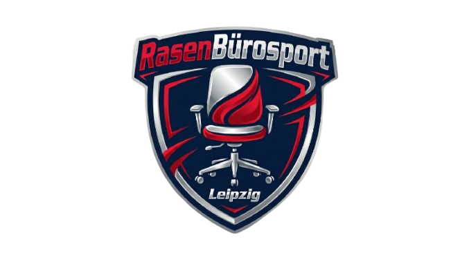

# RasenBürosport Leipzig

**Ergebnisse tracken. Statistiken analysieren. Legenden werden geboren.**

Die App, die aus jeder Kicker-Pause im Büro ein echtes Sportereignis macht.

---

[Dashboard](#-dashboard) · [Neues Spiel](#-neues-spiel) · [Spieldetails](#-spieldetails) · [Rangliste](#-rangliste) · [Profil](#-profil) · [KI-Features](#-ki-features)

---

## Was ist RasenBürosport?

RasenBürosport Leipzig verwandelt den Kicker-Tisch im Büro in eine professionelle Liga. Jedes 1v1-Duell, jedes 2v2-Teamspiel wird erfasst, analysiert und in eine lebendige Statistik-Welt eingebettet — komplett mit KI-generierten Spielberichten, Vorhersagen und einem Badge-System, das jeden Spieler motiviert.

> Gebaut vom **RB Leipzig Data Unit Team**. Angetrieben von **Claude AI**. Designt als **Progressive Web App** für Smartphone, Tablet und Desktop.

---

## Die App im Überblick

### Auf einen Blick

| | Feature | Beschreibung |
|---|---------|-------------|
| 📊 | **Live-Dashboard** | Serien, Aktivitätsfeed, Top-Spieler |
| 🎮 | **Spiel-Wizard** | 3 Schritte: Spieler, Teams, Ergebnis |
| 🔮 | **KI-Vorhersage** | Automatische Match-Prediction vor dem Spiel |
| 📸 | **FC26-Integration** | Screenshot hochladen, KI liest Stats aus |
| 📝 | **KI-Spielbericht** | Automatischer Spielbericht nach dem Match |
| 🏆 | **Rangliste** | Punkte-System mit Zeitraumfilter |
| ⚔️ | **Head-to-Head** | Direkter Vergleich zwischen zwei Spielern |
| 🏅 | **15 Badges** | Freischaltbare Auszeichnungen |
| 📈 | **Karriere-Stats** | xG-Effizienz, Ballbesitz, Passquote |
| ⚽ | **Liga-Statistiken** | Performance pro Liga (Bundesliga, La Liga...) |

---

## 📊 Dashboard

Das Dashboard ist die Kommandozentrale. Hier siehst du sofort, was in der Liga los ist.

**Was du siehst:**
- **Persönliche Serie** — Bist du auf einer Siegesserie oder steckst du in einer Durststrecke?
- **Deine letzten Spiele** — Ergebnisse mit Team-Avataren, Modus (1v1/2v2) und Datum
- **Top 3 Spieler** — Wer führt die Rangliste an?
- **Aktuelle Serien** — Alle Spieler im Überblick: Wer brennt, wer nicht

> *"MaxMustermann steckt in einer Durststrecke... LisaKicker hat eine Siegesserie!"* — Das Dashboard erzählt die Geschichten der Liga.

[Mehr zum Dashboard →](docs/features/DASHBOARD.md)

---

## 🎮 Neues Spiel

Ein neues Spiel ist in drei Schritten erfasst. Kein Overhead, kein Papierkram.

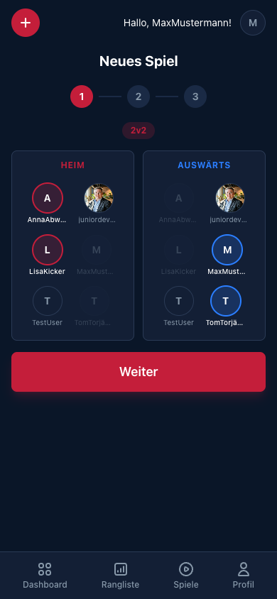
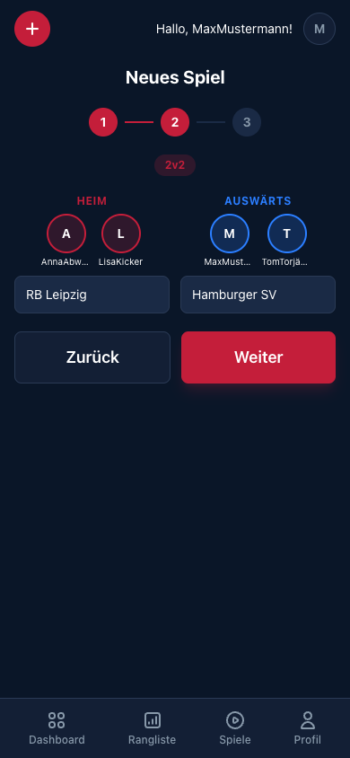
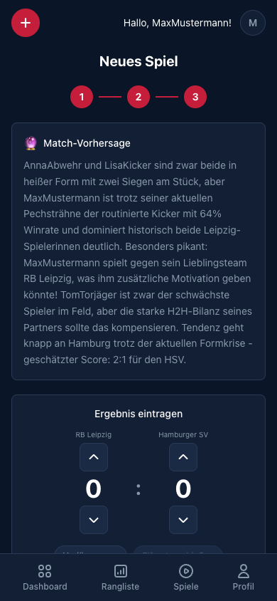

| Schritt | Was passiert |
|---------|-------------|
| **1. Spieler** | Tippe auf Spieler um sie Heim/Auswärts zuzuweisen. 1v1 oder 2v2 wird automatisch erkannt. |
| **2. Teams** | Wähle aus 500+ echten Vereinen weltweit — mit Länderflaggen und Liga-Zuordnung. |
| **3. Ergebnis** | Tor für Tor eintragen. Verlängerung & Elfmeterschießen inklusive. Optional: FC26-Screenshot. |

Sobald Spieler und Teams feststehen, generiert die **KI automatisch eine Match-Vorhersage** — noch bevor das erste Tor fällt.

[Mehr zum Spielassistenten →](docs/features/NEW_GAME.md)

---

## 🏟️ Spieldetails

Jedes Spiel wird zu einer eigenen Geschichte — mit Spielverlauf, Statistiken und KI-Analyse.

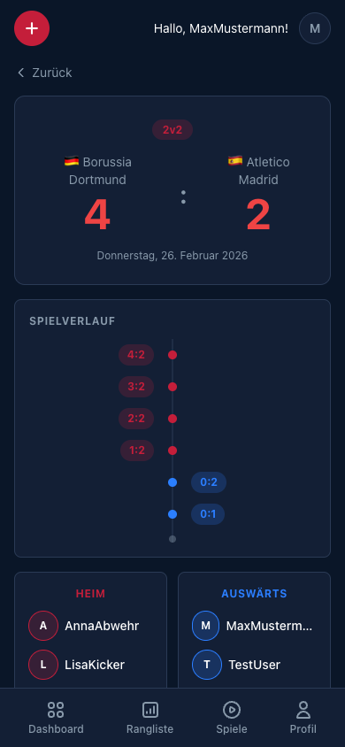
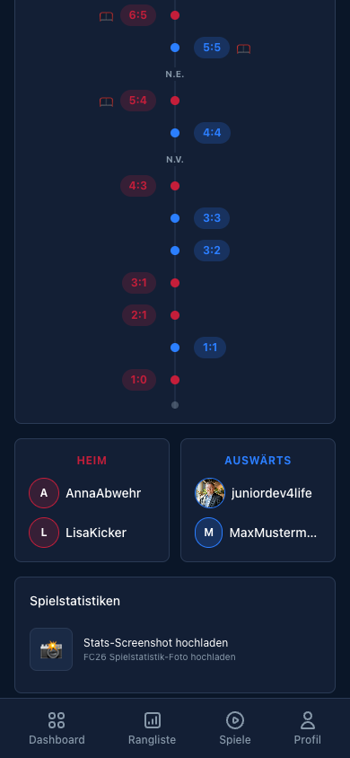

- **Großes Score-Display** mit Vereinsnamen und Länderflaggen
- **Vertikale Timeline** — jedes Tor chronologisch dargestellt, von unten nach oben
- **Verlängerung & Elfmeterschießen** werden visuell getrennt mit n.V. / n.E. Markierungen
- **Team-Aufstellungen** mit Spieler-Avataren

Wenn FC26-Statistiken vorhanden sind, werden diese als interaktiver Vergleich angezeigt — und ein **KI-Spielbericht** wird automatisch generiert.

[Mehr zu Spieldetails →](docs/features/GAME_DETAIL.md)

---

## 🏆 Rangliste

Zwei Perspektiven auf die Liga — für faire Vergleiche.

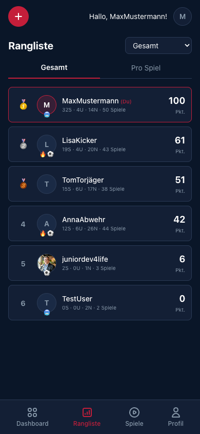
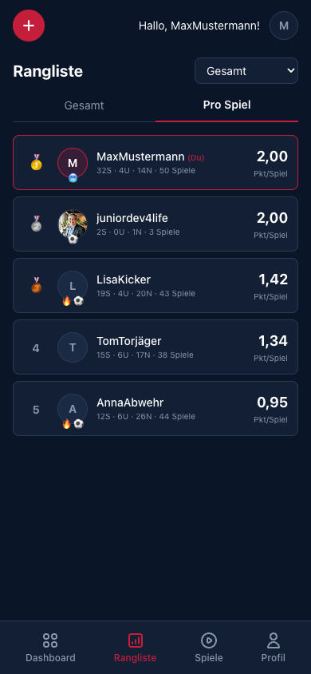

| Modus | Logik |
|-------|-------|
| **Gesamt** | 3 Punkte pro Sieg, 1 pro Unentschieden. Die klassische Tabelle. |
| **Pro Spiel** | Punkte geteilt durch Anzahl Spiele. Fair bei unterschiedlicher Spielanzahl. |

**Zeitraumfilter**: Gesamt · 7 Tage · 30 Tage · 90 Tage

Tippe auf einen Spieler für den **direkten Vergleich**:

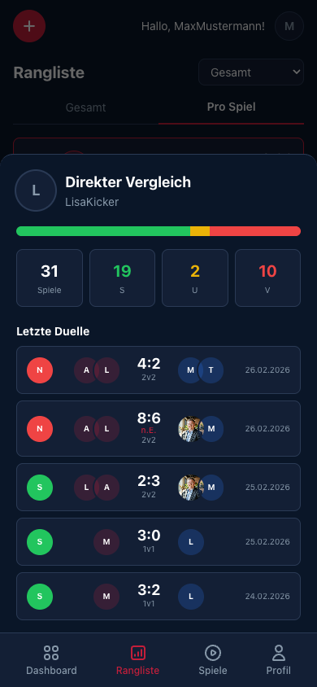

> *31 Spiele, 19 Siege, 2 Unentschieden, 10 Niederlagen* — der Head-to-Head zeigt die vollständige Bilanz inkl. der letzten Duelle.

[Mehr zur Rangliste →](docs/features/LEADERBOARD.md)

---

## 👤 Profil

Das Profil ist das Herzstück deiner Kicker-Karriere — alles was du jemals am Tisch geleistet hast, auf einen Blick.

**Statistiken**: 50 Spiele, 32 Siege, 64% Siegquote — getrennt nach 1v1 und 2v2.

**Karriere-Statistiken** aus 28 Spielen mit FC26-Daten:
- 54% Ø Ballbesitz
- 88% Ø Passgenauigkeit
- 1,08x xG-Effizienz
- 59% Ø Zweikampfquote

**11 von 15 Badges** freigeschaltet — vom Tiki-Taka-Meister bis zum Seriensieger.

**Liga-Statistiken**: 86% Siegquote in La Liga, 71% in der Bundesliga.

[Mehr zum Profil →](docs/features/PROFILE.md)

---

## 🤖 KI-Features

Drei KI-Features, angetrieben von **Claude (Anthropic)**, machen RasenBürosport einzigartig.

### 1. Match-Vorhersage

Wird **automatisch generiert** sobald Spieler und Teams ausgewählt sind. Die KI analysiert:
- Aktuelle Form und Siegquoten aller Spieler
- Head-to-Head-Bilanz der Gegner
- xG-Effizienz und Karriere-Statistiken
- Lieblingsteams und deren Einfluss auf die Motivation

### 2. FC26-Stats-Extraktion

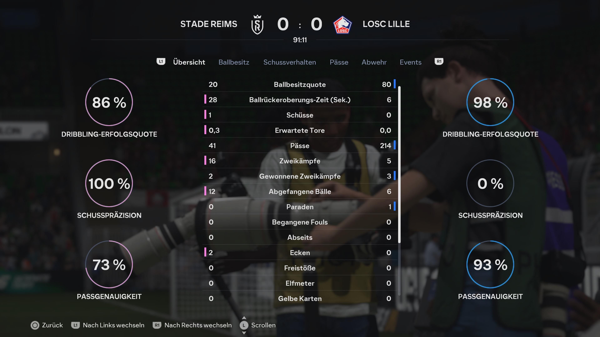

Lade einfach einen Screenshot der FC26-Nachspielstatistiken hoch. **Claude Vision** erkennt und extrahiert automatisch alle 14 Statistik-Werte — von Ballbesitz über xG bis zu Gelben Karten.

### 3. KI-Spielbericht

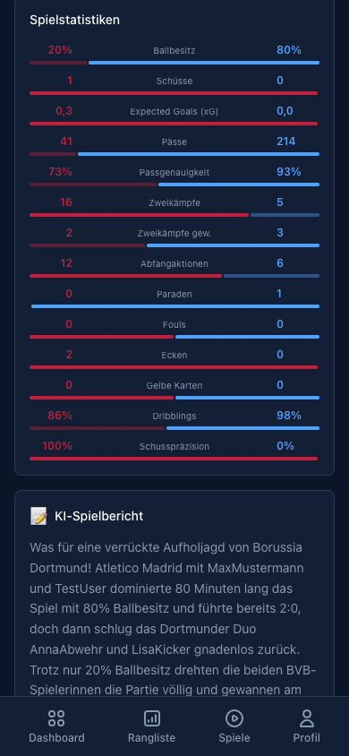

Wird **automatisch generiert** wenn Statistiken vorliegen. Der Bericht ist unterhaltsam, auf Deutsch, und erkennt besondere Narratives:
- Underdog-Siege trotz wenig Ballbesitz
- xG-Überperformance ("Chancentod wird zum Vollstrecker")
- Serienbrüche und historische Meilensteine
- Karriere-Kontext der einzelnen Spieler

[Mehr zu den KI-Features →](docs/features/AI_FEATURES.md)

---

## Technologie

| Bereich | Stack |
|---------|-------|
| **Frontend** | Svelte 5, SvelteKit, TailwindCSS 4 |
| **Backend** | Fastify 5, Node.js 24 |
| **Datenbank** | Supabase (PostgreSQL + Storage) |
| **KI** | Claude API — Anthropic (Vision + Text) |
| **Auth** | Supabase Auth (Invite-only) |
| **App-Typ** | Progressive Web App (PWA) |
| **Sprachen** | Deutsch & Englisch (Tolgee i18n) |
| **Design** | Mobile-first, Dark Theme |

---

## Installation

RasenBürosport ist eine **Progressive Web App** — kein App Store nötig.

1. Öffne die App im Browser (Chrome / Safari)
2. Tippe auf **"Zum Startbildschirm hinzufügen"**
3. Die App erscheint wie eine native App auf deinem Homescreen

Funktioniert auf **iOS**, **Android** und **Desktop**.

---

## Spielhistorie

Alle Spiele auf einen Blick — mit Ergebnis, Modus, Datum und Spieler-Avataren.

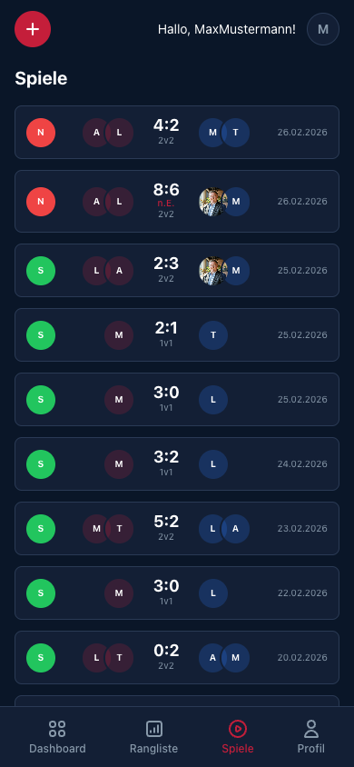

Siege in Grün, Niederlagen in Rot — scrolle durch deine komplette Kicker-Geschichte. Tippe auf ein Spiel für die Detailansicht.

---

---

**RasenBürosport Leipzig** — Wo Büro-Kicker auf Datenanalyse trifft.

*Entwickelt mit Leidenschaft vom RB Leipzig Data Unit Team*

*Angetrieben von [Claude AI](https://anthropic.com) · Gebaut mit [Svelte](https://svelte.dev) · Gehostet auf [Google Cloud](https://cloud.google.com)*

