

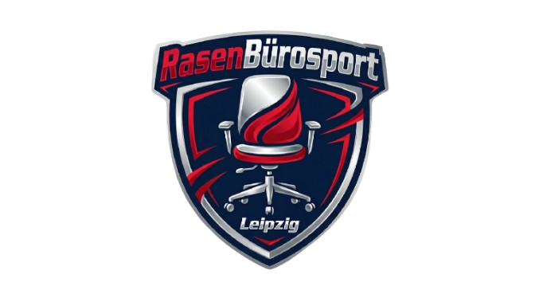

# RasenBürosport Leipzig

**Track results. Analyze stats. Legends are born.**

The app that turns every foosball break at the office into a real sporting event.

---

[Dashboard](#-dashboard) · [Neues Spiel](#-neues-spiel) · [Spieldetails](#-spieldetails) · [Rangliste](#-rangliste) · [Profil](#-profil) · [KI-Features](#-ki-features)

---

## What is RasenBürosport?

RasenBürosport Leipzig transforms the office foosball table into a professional league. Every 1v1 duel and every 2v2 team match is recorded, analyzed and embedded into a lively statistics world — complete with AI-generated match reports, predictions and a badge system that motivates every player.

---

## App Overview

### At a glance

| | Feature | Beschreibung |
|---|---------|-------------|
| 📊 | **Live Dashboard** | Streaks, activity feed, top players |
| 🎮 | **Match Wizard** | 3 steps: players, teams, score |
| 🔮 | **AI Prediction** | Automatic match prediction before the game |
| 📸 | **FC26 Integration** | Upload screenshot, AI reads stats |
| 📝 | **AI Match Report** | Automatic match report after the game |
| 🏆 | **Leaderboard** | Points system with time-range filters |
| ⚔️ | **Head-to-Head** | Direct comparison between two players |
| 🏅 | **15 Badges** | Unlockable achievements |
| 📈 | **Career Stats** | xG efficiency, possession, pass accuracy |
| ⚽ | **League Stats** | Performance per league (Bundesliga, La Liga...) |

---

## 📊 Dashboard

The dashboard is the control center. Here you instantly see what's happening in the league.

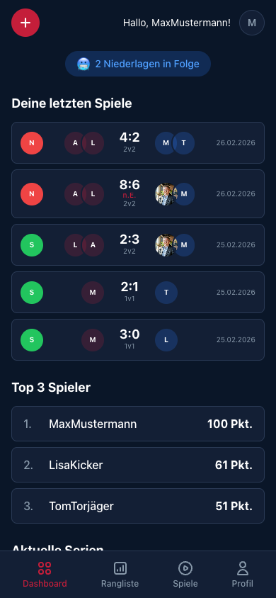
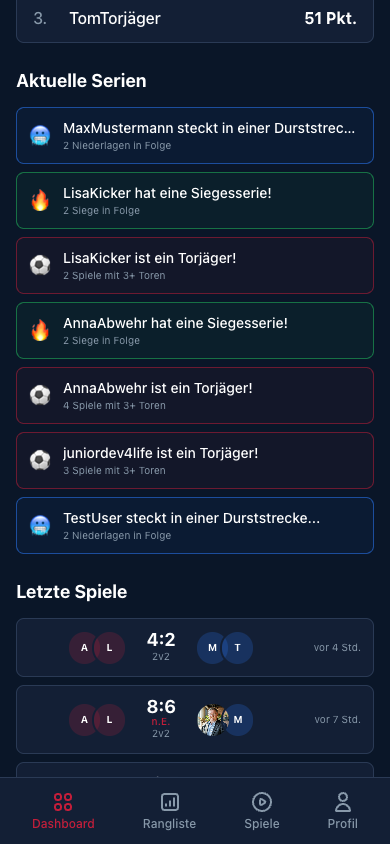

**What you see:**

- **Personal streak** — Are you on a winning streak or in a slump?
- **Your recent matches** — Results with team avatars, mode (1v1/2v2) and date
- **Top 3 players** — Who tops the leaderboard?
- **Current streaks** — Overview of all players: who's hot, who's not

> *"MaxMustermann steckt in einer Durststrecke... LisaKicker hat eine Siegesserie!"* — Das Dashboard erzählt die Geschichten der Liga.

[More about the dashboard →](docs/features/DASHBOARD.md)

---

## 🎮 New Match

A new match is recorded in three steps. No overhead, no paperwork.

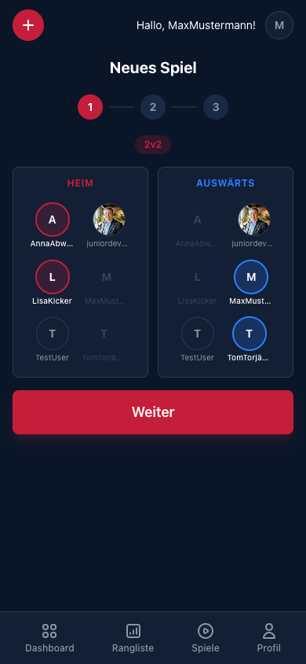
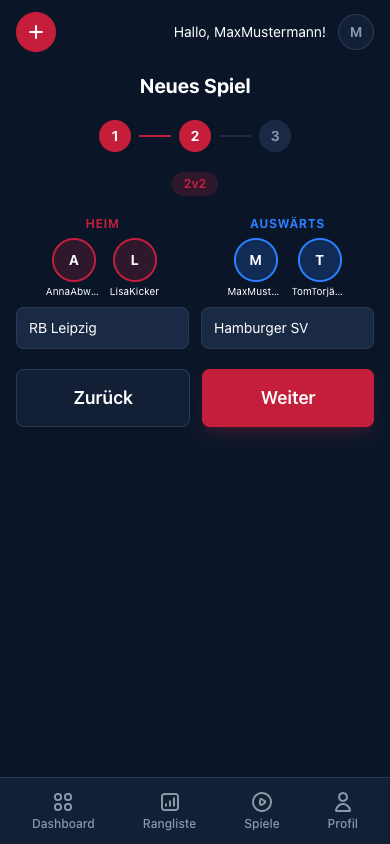

| Step | What happens |
|---------|-------------|
| **1. Players** | Tap players to assign home/away. 1v1 or 2v2 is detected automatically. |
| **2. Teams** | Choose from ~400 real clubs from 25 European top leagues — with country flags and league assignment. |
| **3. Score** | Enter goals one-by-one. Extra time & penalties supported. Optional: FC26 screenshot. |

[Once players and teams are set, the **AI automatically generates a match prediction** — even before the first goal is scored.]

[More about the match wizard →](docs/features/NEW_GAME.md)

---

## 🏟️ Match Details

Every match becomes its own story — with play-by-play, statistics and AI analysis.

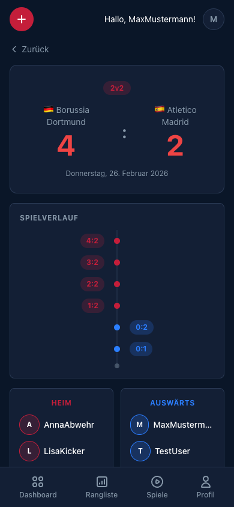
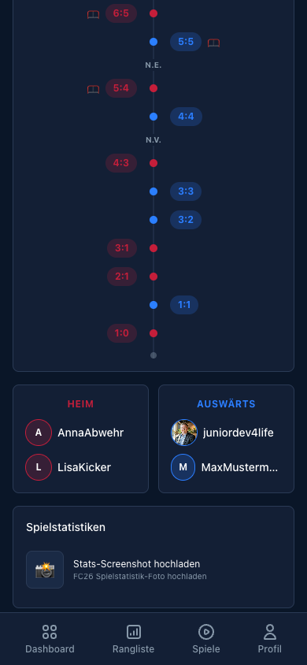

- **Large score display** with club names and country flags
- **Vertical timeline** — each goal shown chronologically, from bottom to top
- **Extra time & penalties** are visually separated with n.V. / n.E. labels
- **Team lineups** with player avatars

Wenn FC26-Statistiken vorhanden sind, werden diese als interaktiver Vergleich angezeigt — und ein **KI-Spielbericht** wird automatisch generiert.

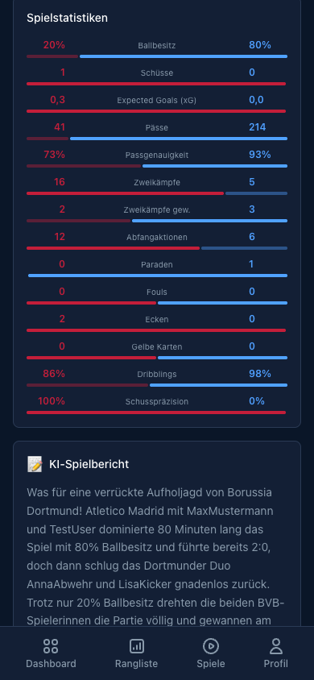

[More about match details →](docs/features/GAME_DETAIL.md)

---

## 🏆 Leaderboard

Two perspectives on the league — for fair comparisons.

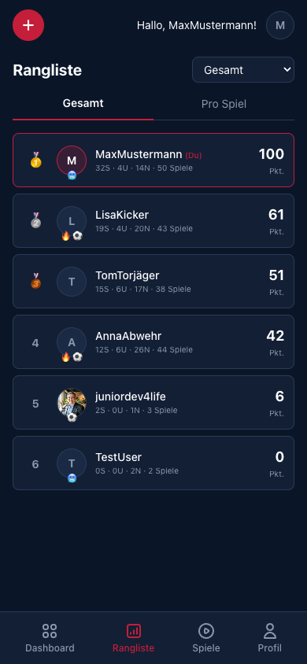
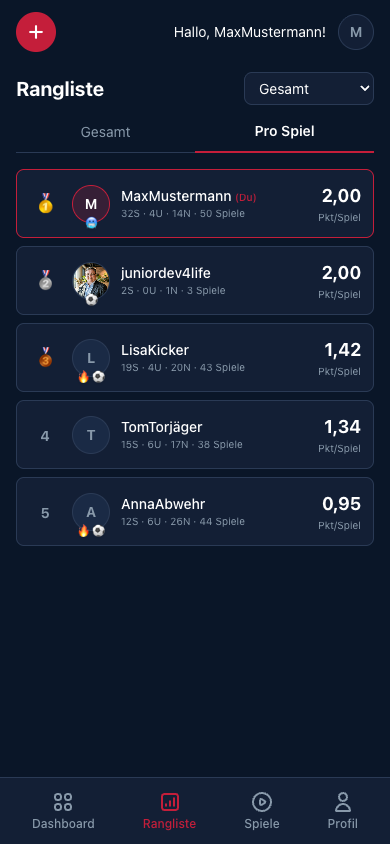

| Mode | Logic |
|-------|-------|
| **Overall** | 3 points per win, 1 per draw. Classic table. |
| **Per Match** | Points divided by number of matches. Fair when players have different match counts. |

**Time range filter**: Overall · 7 days · 30 days · 90 days

Tap a player for the **direct comparison**:

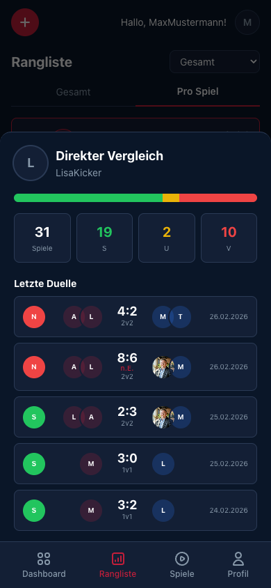

> *31 Spiele, 19 Siege, 2 Unentschieden, 10 Niederlagen* — der Head-to-Head zeigt die vollständige Bilanz inkl. der letzten Duelle.

[More on the leaderboard →](docs/features/LEADERBOARD.md)

---

## 👤 Profile

The profile is the heart of your foosball career — everything you've ever done at the table, at a glance.

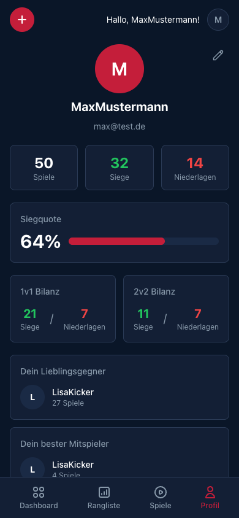
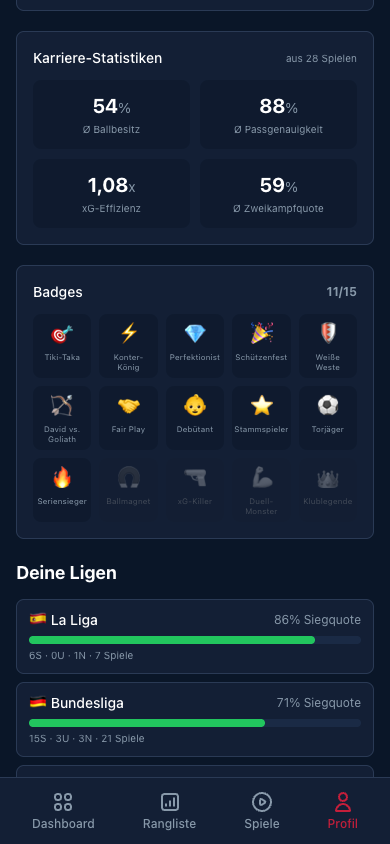

**Statistics**: 50 matches, 32 wins, 64% win rate — split between 1v1 and 2v2.

**Career stats** from 28 matches with FC26 data:

- 54% avg. possession
- 88% avg. pass accuracy
- 1.08x xG efficiency
- 59% avg. duels won

**11 von 15 Badges** freigeschaltet — vom Tiki-Taka-Meister bis zum Seriensieger.

**Liga-Statistiken**: 86% Siegquote in La Liga, 71% in der Bundesliga.

[More about the profile →](docs/features/PROFILE.md)

---

## 🤖 AI Features

Three AI features powered by **Claude (Anthropic)** make RasenBürosport unique.

### 1. Match Prediction

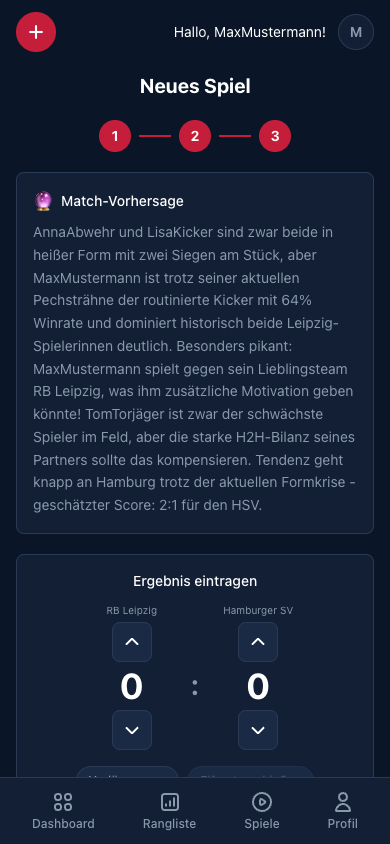

Is **automatically generated** once players and teams are selected. The AI analyzes:

- Current form and win rates of all players
- Head-to-head records between opponents
- xG efficiency and career statistics
- Favorite teams and their motivational impact

### 2. FC26 Stats Extraction

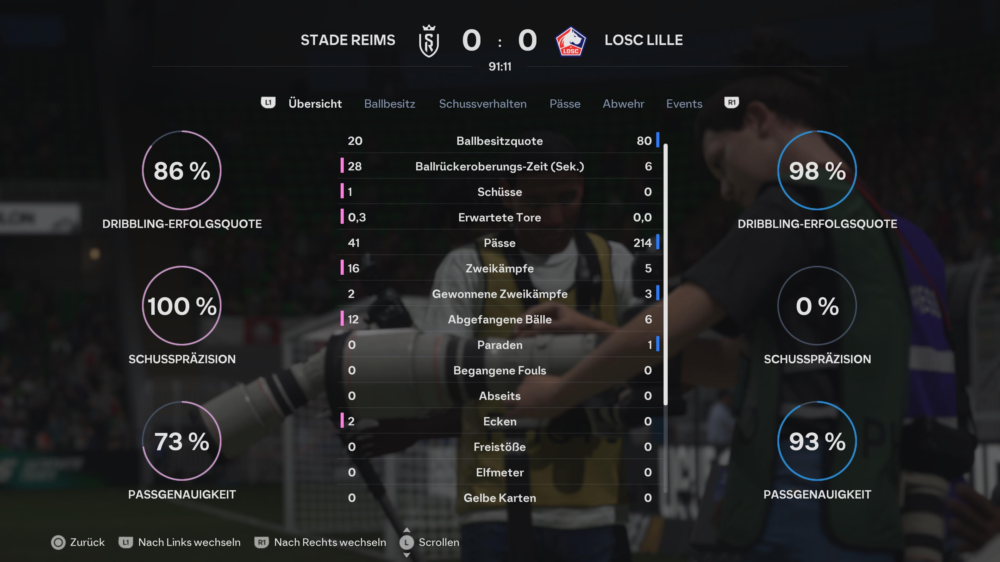

Simply upload a screenshot of the FC26 post-match statistics. **Claude Vision** recognizes and automatically extracts all 14 statistic values — from possession to xG to yellow cards.

### 3. AI Match Report

Is **automatically generated** when statistics are available. The report is entertaining, written in German, and recognizes special narratives:

- Underdog victories despite low possession
- xG overperformance ("from chance-waster to finisher")
- Breaking streaks and historical milestones
- Career context for individual players

[More about the AI features →](docs/features/AI_FEATURES.md)

---

## Technology

| Area | Stack |
|---------|-------|
| **Frontend** | Svelte 5, SvelteKit, TailwindCSS 4 |
| **Backend** | Fastify 5, Node.js 24 |
| **Database** | Cloud SQL PostgreSQL 16 (GCP) |
| **Storage** | Firebase Storage (Avatars, Screenshots, Logos) |
| **AI** | Claude API — Anthropic (Vision + Text) |
| **Auth** | Firebase Auth (Google Sign-In, Invite-only) |
| **Hosting** | Firebase Hosting (Frontend), Cloud Run (Backend) |
| **App Type** | Progressive Web App (PWA) |
| **Languages** | German & English (Tolgee i18n) |
| **Design** | Mobile-first, Dark Theme |

> For local development setup, see [DEVELOPMENT.md](DEVELOPMENT.md).

---

## Installation

RasenBürosport is a **Progressive Web App** — no app store required.

1. Open the app in your browser (Chrome / Safari)
2. Tap **"Add to Home Screen"**
3. The app will appear like a native app on your home screen

Works on **iOS**, **Android** and **Desktop**.

---

## Match History

All matches at a glance — with result, mode, date and player avatars.

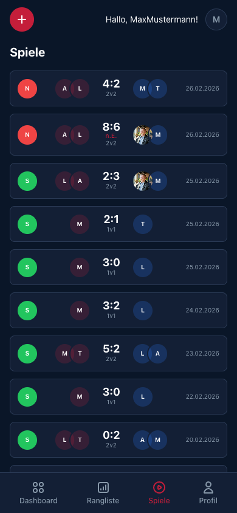

Wins in green, losses in red — scroll through your full foosball history. Tap a match for details.

---

---

**RasenBürosport Leipzig** — Where office foosball meets data analysis.

*Built with passion and AI*

