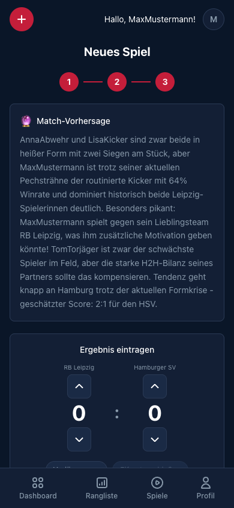

[← Back to overview](../../README.md)

# 🤖 AI Features

Three AI features make RasenBürosport unique — powered by **Claude** (Anthropic).

---

## 1. FC26 Stats Extraction (Claude Vision)

<div align="center">

</div>

### What happens

After an FC26 match you can photograph the **post-match statistics screen** and upload it to the app. **Claude Vision** analyzes the image and automatically extracts all statistic values.

### Extracted statistics

| Category | Values |
|-----------|-------|
| **Possession** | Possession (%), Passes, Pass accuracy (%) |
| **Offense** | Shots, Expected Goals (xG), Shot accuracy (%), Dribbles (%) |
| **Defense** | Duels, Duels won, Interceptions, Saves |
| **Discipline** | Fouls, Corners, Yellow cards |

### How it works

1. **Right after saving**: the app opens the match detail page — upload the screenshots there (see [Screenshot upload](GAME_DETAIL.md#screenshot-upload))
2. **Later**: the upload area stays on the match detail page until the stats are in
3. The image is stored in **Supabase Storage**
4. **Claude Vision** analyzes the screenshot and returns structured data
5. The statistics are stored as JSONB in the match record

### Technical flow

```
Screenshot → Supabase Storage → Claude Vision API → JSON extraction → Database
```

> The extraction works with FC26 screenshots in German and English. The AI model automatically recognizes the table structure.

---

## 2. AI Match Prediction

<div align="center">

</div>

### What happens

As soon as **players and teams** are set in the match wizard (step 3), a prediction is **automatically** generated — before the match begins.

### Data basis

The AI considers for each player:

| Data source | Example |
|-------------|---------|
| **Career stats** | 50 matches, 64% win rate |
| **Current form** | 2 losses in a row |
| **xG efficiency** | 1.08x (scores more than expected) |
| **Head-to-head** | 19 wins in 31 duels vs. LisaKicker |
| **Favorite team** | Plays with RB Leipzig — extra motivated? |
| **Match mode** | 1v1 or 2v2 |

### Example output

> *"AnnaAbwehr and LisaKicker are both in form with two wins in a row, but MaxMustermann — despite a recent unlucky streak — is the more experienced player with a 64% win rate. Especially spicy: MaxMustermann plays against his favorite club RB Leipzig! Slight edge to Hamburg — estimated score: 2:1 for HSV."*

### Characteristics

- **Automatic** — no button, no interaction required
- **In German** — the tone is casual and entertaining
- **Data-driven** — real career data is used
- **One-time** — one prediction per match, no regeneration

---

## 3. AI Match Report

<div align="center">

</div>

### What happens

After the match, once **FC26 stats** are available, an AI-generated match report is created automatically. The report reads like a sports commentary and is based on real data.

### Data basis

| Source | Use |
|--------|-----------|
| **Match result** | Score, timeline, result type |
| **Match stats** | Possession, xG, passes, duels |
| **Career data** | Win rate, xG efficiency, current streak per player |
| **Context** | Underdog situations, personal bests |

### Narratives detected

The AI automatically detects notable situations and weaves them into the report:

- **Comeback** — a team was behind and turned the match around
- **Underdog win** — won despite significantly less possession
- **xG overperformance** — more goals than expected
- **Chance-waster** — many chances, few goals
- **Streak broken** — a winning or losing streak ends
- **Career milestones** — scoring milestones, reaching regular starter status

### Example output

> *"What a crazy comeback by Borussia Dortmund! Atletico Madrid with MaxMustermann and TestUser dominated for 80 minutes with 80% possession and were leading 2:0, but then the Dortmund duo AnnaAbwehr and LisaKicker struck back mercilessly. Despite only 20% possession the two BVB players completely turned the match and won..."*

### Characteristics

- **Automatic** — generated once match stats are available
- **Saved** — the report is stored in the DB and shown on next visit
- **Personalized** — includes each player's career data
- **3–5 sentences** — short, punchy, entertaining

---

## Technology

| Component | Technology |
|------------|------------|
| **AI model** | Claude (Anthropic) |
| **Vision** | Claude Vision API for screenshot analysis |
| **Text** | Claude Text API for reports & predictions |
| **Prompts** | Stored as constants in backend code |
| **Caching** | Generated reports are cached in the DB |
| **Language** | All outputs in German |

---

[← Profile](PROFILE.md) · [Back to overview](../../README.md)
