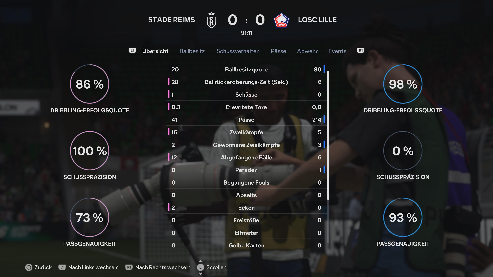
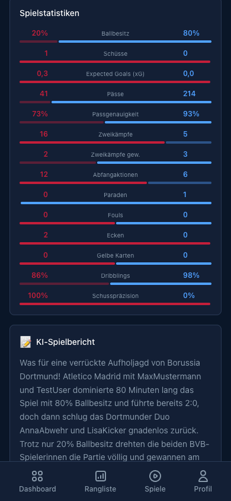

[← Back to overview](../../README.md)

# 🤖 AI Features

The AI side of RasenBürosport is powered by **Claude** (Anthropic): it reads the FC26 stats screens, writes the match reports and scripts the weekly talk show.

---

## 1. FC26 Stats Extraction (Claude Vision)

<div align="center">

</div>

### What happens

After an FC26 match you photograph three tabs of the **post-match statistics screen** — **Overview**, **Passes** and **Defence** — and upload them to the match. **Claude Vision** analyzes each image and automatically extracts all statistic values. Matches played with the office recording get their stats from the recording automatically — no photos needed.

### Extracted statistics

| Screenshot | Values |
|-----------|-------|
| **Overview** | Possession, ball recovery time, shots, Expected Goals (xG), passes, pass accuracy, duels & duels won, interceptions, saves, fouls, offsides, corners, free kicks, penalties, yellow cards, dribbling, shot accuracy |
| **Passes** | Passes & completed passes, pass accuracy, intercepted & offside passes, ground and lob passes, through balls (incl. lobbed), crosses, set pieces, key passes, first-time passes, one-twos, wing play, solo runs — plus both **pass networks** |
| **Defence** | Tackle success, fair / won / slide tackles, interceptions, blocks, saves, clearances, attacking / defensive / aerial duels won, dribbled past, fouls, penalties conceded, yellow & red cards |

The pass networks (who passes to whom, and where on the pitch) become each team's **pass character** on the match page: central, left-leaning, right-leaning, balanced or wing play.

### How it works

1. **Right after saving**: the app opens the match detail page — upload the screenshots there (see [Screenshot upload](GAME_DETAIL.md#screenshot-upload))
2. **Later**: the upload area stays on the match detail page until the stats are in
3. Each image is resized and stored in **Firebase Storage**
4. **Claude Vision** analyzes the screenshot and returns structured data
5. The statistics are stored as JSONB in the match record
6. Once all three screenshots are in, the match report is written

### Technical flow

```
Screenshot → Firebase Storage → Claude Vision API → JSON extraction → Database
```

> The extraction works with FC26 screenshots in German and English. The AI model automatically recognizes the table structure — and if a pass network can't be read clearly, it's left empty instead of guessed.

---

## 2. AI Match Report

<div align="center">

</div>

### What happens

Once a match is complete, an AI-generated match report appears on the match page. It reads like a short TV post-match piece and is based on real data. Manually tracked matches get it once all three FC26 screenshots are in; recorded matches once the recording analysis is done.

### Three reporters

| Reporter | Style |
|----------|-------|
| **Marcel**, the Chronicler | Classic TV commentary — three decades in the booth |
| **Sophie**, the Analyst | Tactical and data-focused |
| **Frank**, the Enthusiast | Emotional and over the top |

Who gets the mic depends on the match: a big comeback or a hattrick goes to Frank, an early red card to Marcel, a clear win without drama to Sophie. Everything else is a draw weighted by how dramatic the match was — and a reporter who narrated the last two reports is much less likely to get a third. Tap the reporter on the match page to read their bio.

### Data basis

| Source | Use |
|--------|-----------|
| **Match result** | Score, timeline (goals, assists, cards, missed penalties), result type |
| **Match stats** | Possession, xG, passes, duels, pass networks |
| **Career data** | Win rate, xG efficiency, current streak per player |
| **Storylines** | Streaks of 3+, weekly challenges completed in this match, newly unlocked achievements |

### What shapes the story

The **drama level** — score difference, red cards, late goals, comebacks — sets the reporter's tone. On top of that, the report picks up:

- **Comeback** — a team turned the match around after trailing by 2+
- **Red cards** — including how long a team played a man down
- **Late drama** — goals after the 80th minute
- **Streaks** — winning or losing runs of 3+
- **Challenges & achievements** — completed in this very match
- **Tactics** — one short note when a team's passing style stood out

### Example output

> *"What a crazy comeback by Borussia Dortmund! Atletico Madrid with MaxMustermann and TestUser dominated for 80 minutes with 80% possession and were leading 2:0, but then the Dortmund duo AnnaAbwehr and LisaKicker struck back mercilessly. Despite only 20% possession the two BVB players completely turned the match and won..."*

### Characteristics

- **Automatic** — generated as soon as the match data is complete
- **Saved** — the report is stored in the DB and shown on next visit
- **Personalized** — includes each player's career data
- **60–90 words** — short, punchy, written to be read aloud
- **Fact-first** — the prompt forbids inventing goals, names or minutes; missing data is left out
- **Audio** — when audio reports are switched on, ElevenLabs reads the report aloud

---

## 3. Friday Talk Show

Once a week, Marcel, Sophie & Frank sit down for an audio episode about the office week: the league's numbers, the match of the week and the players on the rise or in a slump. Claude writes the script from the week's data, ElevenLabs gives the three reporters their voices. The episode plays right on the [dashboard](DASHBOARD.md#friday-talk-show) card.

---

## Technology

| Component | Technology |
|------------|------------|
| **AI model** | Claude (Anthropic) |
| **Vision** | Claude Vision API for screenshot analysis |
| **Text** | Claude Text API for match reports and the talk show script |
| **Voice** | ElevenLabs text-to-speech for the talk show and audio match reports |
| **Prompts** | Stored as constants in backend code |
| **Caching** | Generated reports are cached in the DB |
| **Language** | All outputs in German |

---

[← Profile](PROFILE.md) · [Back to overview](../../README.md)
