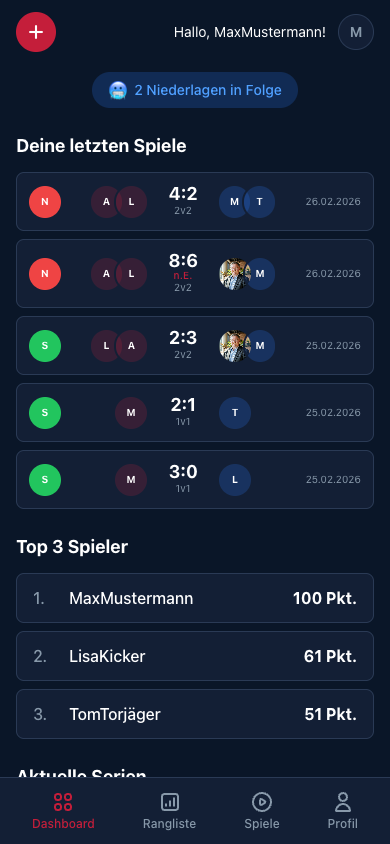
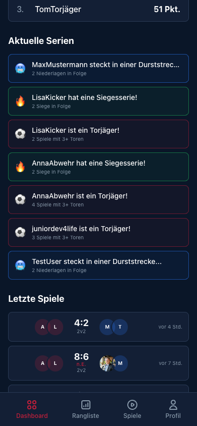

[← Back to overview](../../README.md)

# 📊 Dashboard

The dashboard is the first page after login — the pulse of the office league.

---

## Layout

### Greeting & current streak

At the top you receive a personal greeting. Directly below you see your **current streak** — are you on fire or in a slump? The badge shows it instantly.

### Your recent matches

The last 5 matches at a glance:

- **Color coding**: Green = win, Red = loss
- **Player avatars** for both teams
- **Mode badge**: 1v1 or 2v2
- **Special marker**: n.E. (after penalties)
- **Date** of each match

### Top 3 players

The current leaderboard top — with points. Tap to open the full leaderboard.

---

## Current streaks & activity feed

### Streak feed

All active streaks for every player at a glance:

- 🔥 **Winning streaks** — *"LisaKicker is on a winning streak! 2 wins in a row"*
- 😰 **Slumps** — *"MaxMustermann is in a slump..."*
- ⚽ **Top scorer badges** — *"AnnaAbwehr is a top scorer! 4 matches with 3+ goals"*

### Recent matches (global)

The latest matches from all players with relative time labels ("4h ago", "7h ago").

---

## Quick action

The red **+** button top-left immediately starts a new match — a single tap opens the wizard.

---

[← Back to overview](../../README.md) · [New Match →](NEW_GAME.md)
