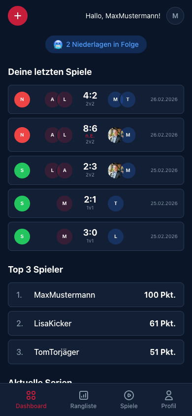
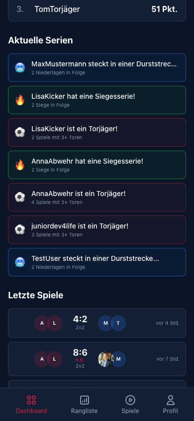

[← Back to overview](../../README.md)

# 📊 Dashboard

The dashboard is the first page after login — the pulse of the office league, seen through your own week.

On the phone the cards stack in one column; on desktop they sit side by side in a grid. First visit? A short guided tour walks you through the cards.

---

## Your week

### Frank's week check

The top card belongs to **Frank**, one of the three reporter personas, and sums up your current calendar week (Monday to Sunday):

- A one-liner that matches your week — hype after a good run, comfort after a rough one, a nudge if you haven't played yet
- **Record** (wins:losses), **ELO Δ** and **matches** for the week
- The calendar week (**KW**): in the red band in design A, as a pill in the header in design B
- Tap Frank's picture to read his bio

In design A the card is the red band right under the header; in design B it is a white card with Frank's verdict in a speech bubble.

### Recent highlights (desktop only)

Next to Frank's card, the desktop shows the four most recent matches with a finished highlight reel — video preview, matchup, date and score. Tap one to watch it on the match page.

### Weekly challenges

Your active weekly challenges, each with a progress bar and a count (*2 / 3*), plus a summary like *1 von 3 geschafft*. **Alle ansehen** opens the challenges page.

### Friday talk show

Marcel, Sophie & Frank talk through the office week in an audio episode — play it right on the card. Episodes younger than 7 days carry a **Neu** chip; until the first episode exists, the card tells you when it drops. **Zum Rückblick** opens the weekly recap (*Wrapped*).

---

## Streaks & numbers

### Current streaks

Only shows up when you're on a run — and it's all about you. Each streak shows its length and kind ("5 Siege in Folge"): as a big number in design A, as fanned-out cards in design B.

- **Winning streak** — 3+ wins in a row
- **Slump** — 3+ losses in a row
- **Top scorer** — you scored 3+ goals yourself in at least 2 of your last 5 matches
- **The wall** — your team kept a clean sheet in at least 2 of your last 5 matches

### Your standing

- Your current **ELO** — see [how the ranking works](LEADERBOARD.md#how-the-ranking-works)
- Your **ELO change this week**
- Your **last 5** results as S / U / N markers
- **Zum Profil** opens your profile

### Your last matches

Your own three most recent matches:

- **Result**: an S / U / N marker in design A; in design B the score chip leads the row
- **Opponents** plus **date · mode** (1v1 / 2v2)
- **Score** in the colour of the result (design A)
- Your **ELO change** for that match

Tap a row for the match details, or **Alle Spiele** for the full match history.

### Top 3 of the league

The top 3 of the running season's ranking (players with 5+ matches) — rank, avatar, name and rating; a podium in design B. Tap a player to open their profile, or **Zur Rangliste** for the full leaderboard.

> The dashboard reads the league's 20 most recent matches. After a longer break, some of your numbers stay empty (—) until you play again.

---

## Quick action

The red **+** button in the middle of the bottom bar immediately starts a new match from any page — a single tap opens the wizard. On desktop, it's the red **Quick game** button in the sidebar and in the top bar.

---

[← Back to overview](../../README.md) · [New Match →](NEW_GAME.md)
