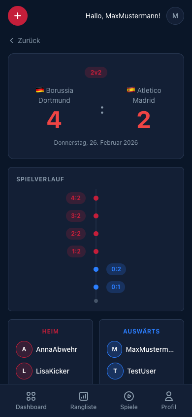
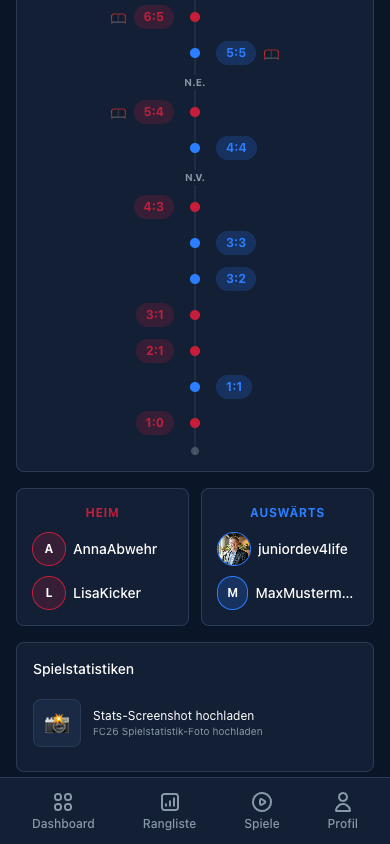

[← Back to overview](../../README.md)

# 🏟️ Match Details

Every match becomes its own story — with score, highlight reel, timeline, statistics and an AI match report.

---

## Score & teams

- **Mode badge** (1v1 / 2v2) plus **date and kick-off time** ("Do., 26. Feb. · 19:30")
- **Club logos and names** around a **large score** — the winner lights up, the loser side is muted
- **AET** / **Pen.** (German: *n.V.* / *n.E.*) when the match went to extra time or penalties — after a penalty shootout, the shootout score is shown instead
- **Home / Away** with a win, draw or loss tag and the players of each side
- **Match tags** that describe the story, e.g. *Comeback*, *Late drama*, *Clear win* or *Goal fest*
- **Start rematch** — same teams, fresh match (see [Rematch](NEW_GAME.md#rematch))

### Penalty shootout

If the match was decided on penalties, a **Penalty thriller** card follows: the shootout score, who won it, and every shot in order — shooter and result (goal, saved by the keeper, or post / wide).

---

## Highlight reel

Matches played with the office recording get a highlight reel:

- **Ready** — the video plays right on the page; on desktop it runs large with the headline numbers next to it
- **Processing** — "Highlights are being created…"; this takes a few minutes and the page refreshes itself
- **Failed** — a short note that there are no highlights for this match

Matches without a recording simply don't show the section. If nobody logged any events during a recorded match, the page first says the result is being determined from the recording — goals, scorers and ELO fill in once the analysis is done.

---

## Match timeline (score timeline)

The vertical timeline shows every goal chronologically — **Full-time** at the top, **Kick-off** at the bottom:

- **Home goals** on the left in red, **away goals** on the right in green
- **Minute bubbles** on the center line, including stoppage time (*45+2'*)
- **Scorer** and **assist** next to the running score
- Goals from a penalty shootout are included; cards and missed penalties are not shown here

---

## Lineups & performance

Two lineup cards (Home / Away), each with a win, draw or loss tag. Every player gets their goals and assists in this match and their ELO change — your own name shows in your accent colour.

---

## FC26 match statistics

The stats come from three FC26 screenshots — **Overview**, **Passes** and **Defence** — or automatically from the office recording. Once they're in, three cards show them:

| Card | What it shows |
|------|---------------|
| **Headline numbers** | Possession, xG, shots and shot accuracy — four tiles with a split bar each |
| **Pass character** | One mini pitch per team with its passing style: central, left-leaning, right-leaning, balanced or wing play — read from the pass networks on the Passes screenshot |
| **Detail statistics** | The five stats where the two teams differ most — picked from pass accuracy, passes, duels, tackles, interceptions, dribbling, saves, fouls, corners, yellow cards, key passes, crosses, blocks and clearances |

The better value is highlighted in the team colour. For fouls, cards and similar "lower is better" stats, the smaller number wins. Until the stats are in, a placeholder says they follow after the report.

---

## AI match report

One of three reporters narrates the match — **Marcel** (the Chronicler), **Sophie** (the Analyst) or **Frank** (the Enthusiast). Tap the reporter to read their bio. The report is generated **automatically**: for manually tracked matches once all three FC26 screenshots are in, for recorded matches once the recording analysis is done — then it doesn't need the screenshots.

- **Written in German**
- **Entertaining** in tone — like a sports commentator
- **Data-driven** — includes the timeline, possession, xG, career data
- **Narrative** — picks up stories like comebacks, late drama, red cards and streaks

> *"What a crazy comeback by Borussia Dortmund! Atletico Madrid dominated for 80 minutes with 80% possession, but then the Dortmund duo struck back..."*

More on the reporters in [AI Features](AI_FEATURES.md#2-ai-match-report).

---

## Screenshot upload

FC26 screenshots are added on the match detail page — the wizard has no upload step. Right after saving, the app opens the new match, and the **FC26 screenshots** card sits below the score:

1. Tap **Add all three now** (or pick them from your gallery)
2. Select the three FC26 stat screenshots: **Overview**, **Passes** and **Defence**
3. AI automatically extracts all statistics — the card shows each screenshot being read, one after the other
4. Once all three are in, a match report is generated

> Recorded matches get their stats from the recording automatically — there the upload is only a fallback, folded away under **Upload statistics manually**.

Admins additionally see a **Danger zone** at the bottom to delete the match.

---

[← New Match](NEW_GAME.md) · [Back to overview](../../README.md) · [Leaderboard →](LEADERBOARD.md)
