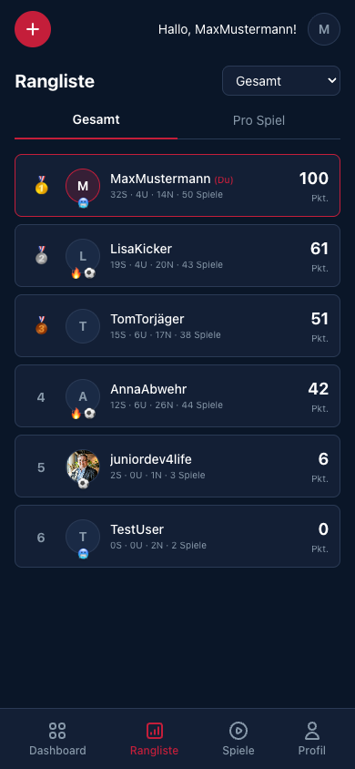
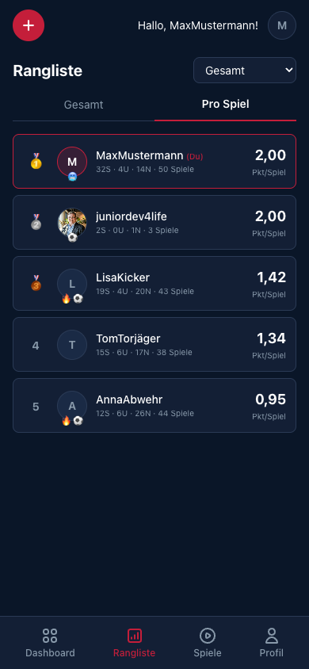
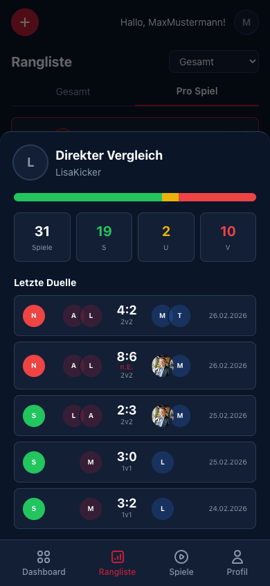

[← Back to overview](../../README.md)

# 🏆 Leaderboard & Head-to-Head

The leaderboard shows who sits at the top of the office league — and the head-to-head reveals who you really perform well against.

---

## Leaderboard

### Two modes

| Mode | Description |
|-------|-------------|
| **Overall** | Sorted by total points. 3 points per win, 1 per draw, 0 per loss. |
| **Per Match** | Points divided by number of matches. Fair comparisons when players played different amounts. |

### Player display

- **Rank** with medal icons (🥇🥈🥉) for the top 3
- **Avatar** and **username**
- **Record**: Wins · Draws · Losses · Matches
- **Points** (total) or **Pts/Match** (per match)
- **Streak badges**: fire emoji for current winning streaks, top scorer badge
- **"You" marker** on your own entry

### Time range filter

Top-right you can filter the time range:

- **Overall** — all matches since the beginning
- **7 days** — weekly form
- **30 days** — monthly trend
- **90 days** — season form

---

## Head-to-Head

Tap **Compare** at the top right of the leaderboard, pick your opponent and tap **Start comparison** to open the **direct comparison**. It always pits you against one other player — tapping a player in the leaderboard opens their profile instead.

### What the H2H shows

- **Visual record bar** — Green (wins), Yellow (draws), Red (losses)
- **Big numbers**: matches, wins, draws, losses
- **Recent duels** — shared matches in chronological order
  - result with color coding
  - player avatars for both teams
  - mode and date

### Example

> MaxMustermann vs. LisaKicker: **31 matches**, 19 wins, 2 draws, 10 losses.
> The rivalry is real.

---

[← Match Details](GAME_DETAIL.md) · [Back to overview](../../README.md) · [Profile →](PROFILE.md)
