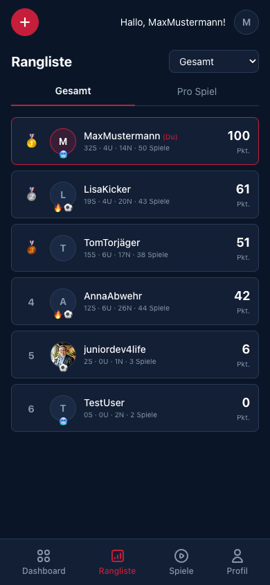
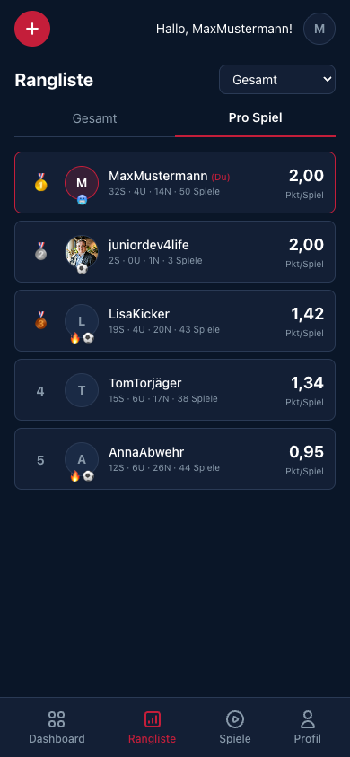
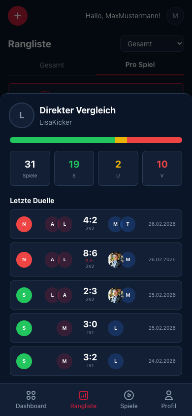

[← Back to overview](../../README.md)

# 🏆 Leaderboard & Head-to-Head

The leaderboard shows who sits at the top of the office league — ranked by ELO — and the head-to-head reveals who you really perform well against.

---

## Leaderboard

### Seasons

A league season is an EA FC edition (FC26, FC27, …), not a calendar quarter — ELO runs continuously across seasons, there is no reset. A segmented control at the top switches between them: the current season reads "**FC27 · läuft**", a closed one "**FC26 · Endstand**". Your choice is kept in the page URL (`?season=`), so a shared link opens the same season.

### Rating

The ranking is ELO only — there is no points table, because players who play more would simply collect more points. ELO is a single rating per player across every mode (1v1, 2v2, 1v2), starting at 1500:

- Each match is zero-sum — what one side gains, the other loses — and goal difference counts moderately on top of the result. The winner always gains at least 1 point
- Assists, saved penalties and red cards add a bonus or malus; yellow cards no longer cost points
- 2v2 and 1v2 matches count at a 0.75 weight, and repeating the exact same line-up several times in the same week counts for less
- A penalty shootout counts as a narrow win/loss for ELO. The 1v2 handicap is learned automatically rather than fixed

Two tabs sit below the season switch:

| Tab | Shows |
|-----|-------|
| **Spieler** | Every player with at least 5 matches in the selected season, sorted by rating |
| **Duos** | Pairings with at least 5 matches together in the selected season, sorted by duo rating |

A rating carried over from earlier seasons doesn't list anyone on its own: whoever has fewer than 5 matches in the season is left out, in the running season as in a closed one, and the dashboard's top 3 follow the same list. On **Spieler**, a sort toggle switches between **Aktuell** (live rating) and **Form** (the rating trend over a player's last 10 rated matches).

**Closed-season qualification**: once a season ends, only players who reached the season's minimum match count are eligible for its top spot and its "Meister" award — a higher raw rating from very few matches doesn't count. Non-qualified players with at least 5 matches still appear in the list, below a small "unter *N* Spielen · nicht gewertet" divider.

### Hero card

The season leader (the top *qualified* player) gets a hero card: rating, a sparkline of recent ratings, "+*N* seit Saisonstart" and — for the running season — "±*N* diese Woche", plus the W · D · L · games record and a gold streak chip (lightning icon and length) while on a win streak of 3 or more. For a closed season the label reads "*Edition*-Meister" instead of "Spitzenreiter".

### Player display

- **Rank** as a number; in design B the top 3 get gold, silver and bronze badges
- **Avatar** and **username**
- **Badges**: a lightning chip with the length of a win streak (3+ in a row), **Ich** on your own entry
- **Stats line**: Spiele · S U N for the season; on desktop the ranking is a table that adds the goals
- **Sparkline** of the recent rating curve
- **Rating** with a trend pill: the season delta when sorted by **Aktuell**, the form delta when sorted by **Form**

Tap a player to open their profile.

### Duos

Two overlapping avatars, both names, the duo's rating, its season delta and the season's W/D/L plus the pair's all-time match count. Tap a duo to open its **duo page**.

### Season awards & recap

Once a season closes, an **awards strip** appears below the ranking: horizontally scrollable chips for Meister, Torschützenkönig, Vorlagenkönig, Dream-Duo, Elfmeterkönig, Fairplay-Preis, Die Mauer, Dauerbrenner, Form der Saison, Mittagspausen-König, Comeback-König and Pechvogel — each with its winner(s) and the value they won it with. If you have a generated recap for that season, a button opens it: **"Dein *Edition*-Rückblick"**. See [Season Recap →](SEASON_RECAP.md).

---

## Head-to-Head

Tap **Compare** at the top right of the leaderboard, pick your opponent and tap **Start comparison** to open the **direct comparison**. It always pits you against one other player — tapping a player in the leaderboard opens their profile instead. The picker lists all players by ELO; duo vs. duo is marked **Soon**.

### What the H2H shows

- **Duel card** — both players with avatar, player type and current ELO, and your head-to-head wins in the middle. A 👑 marks whoever leads by 2+ wins, a 🔥 badge counts a run of 2+ duel wins in a row, and Sophie, the analyst among the reporters, sums up the rivalry in one line
- **ELO delta over time** — the rating gap between you two after each direct duel (shown from 3 duels on)
- **Character compared** — both player radars (Finisher, Playmaker, Clutch, Consistency, Discipline, Winner) overlaid in one chart
- **Stat compare** — goals per game in your duels, plus career win rate, total wins, assists per game and total games
- **Recent direct duels** — your last 5 matches against each other, with date, score and each player's ELO change

Never played each other? The page says so, with a **Back to selection** button.

### Example

> MaxMustermann vs. LisaKicker: **31 matches**, 19 wins, 2 draws, 10 losses.
> The rivalry is real.

---

[← Match Details](GAME_DETAIL.md) · [Back to overview](../../README.md) · [Profile →](PROFILE.md)
