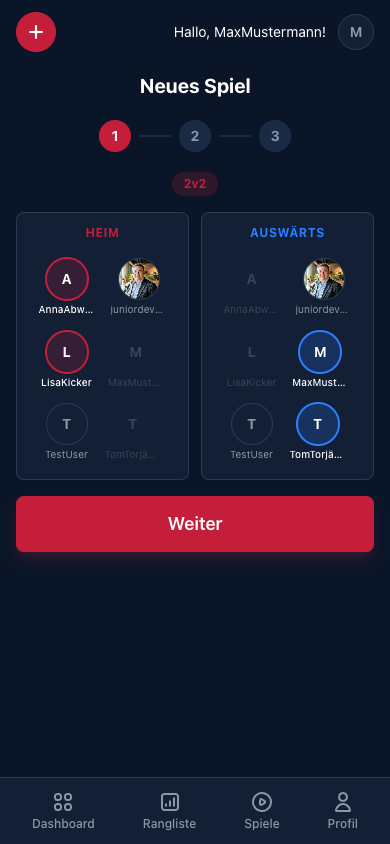
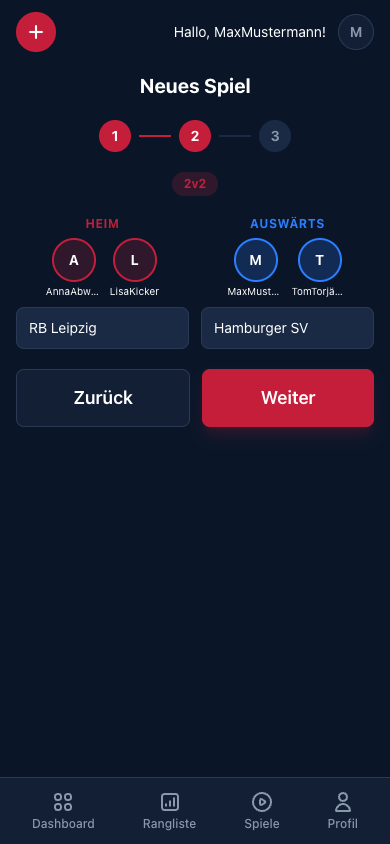

[← Back to overview](../../README.md)

# 🎮 New Match

The match wizard takes you from the lineup to the final whistle: **lineup → kick-off poster → live match**, plus a penalty shootout when it comes to that. Lineup, poster and live match each have a short guided tour on first use — tap **?** in the banner to replay it.

---

## Step 1 — lineup

*"Who's playing today?"* — players pick their side right on the pitch:

- **Tap** an avatar on the home or away half to put that player on that side; tap again to remove them
- A player picked on one side is greyed out on the other
- Each side needs at least one player, up to five
- The **match mode** follows from the lineup: 1 vs. 1 is **1v1**, 2 vs. 2 is **2v2**
- **Guests** — one guest tile per side for spontaneous players without an account; guests don't collect stats or ELO

---

## Step 2 — kick-off poster

*"Kick-off ready"* — the app has already rolled two random clubs for you:

- Both clubs share the same **star rating** (4–5★ by default), so the poster says **Balanced**
- Each side shows the **club logo**, **overall rating**, **stars** and the **players**
- **Reroll** for a new pair
- **Customize** to set the star range (min. / max. stars)
- **Manual** to pick the clubs yourself — type the club name and choose from the suggestions

Tap **Kick-off — start the match** to go live.

---

## Step 3 — live match

### Recording

Kick-off also starts the **office recording**. The app waits until the recording is live (*"Connecting to the recording…"*) — or tap **Start without recording**. If it can't start, **Try again** takes you back to the poster (kick off again to retry), or **Play without recording** carries on without video.

### Entering events

There is no score counter — the score is built from the events you log:

- **Goal** — tap the scorer, set the minute (stoppage time at 45, 90 and 120) and save
- **Assist** — while a goal is open, tap a teammate
- **Goal type** — open play by default; switch to corner, free kick or penalty in the editor
- **Own goal** — long-press the player
- **Red card** — tap **Red**, then the player
- **Missed penalty** — tap **Penalty**, then the shooter, then the keeper who saved it
- **Extra time** — goals after minute 90 put the match into extra time automatically (*n.V.*)
- **Mistakes** — every event appears as a pill and can be removed; the score is recalculated

**End match** saves the game. Going back from the live step asks first — it discards the logged goals and the running recording.

---

## Penalty shootout (optional)

Tap **11m** in the live step to decide the match on penalties:

- Pick the **shooter**, then **Goal** or **Missed**
- Missed? Pick the **keeper** who saved it, or **Post / wide / no save**
- Five shots per team, then sudden death
- For ELO, the match counts as a draw; every shot adds a little on top: +3 for a goal, −5 for a miss, +5 for the keeper who saves it
- **Undo last shot** fixes a slip; **Cancel penalty shootout** drops the shots and returns to the live match with the score unchanged
- Once it's decided, **End match** saves the game with the shootout (*n.E.*)

---

## Rematch

On the match detail page, **Start rematch** (*same teams · fresh match*) jumps straight to the live step — same lineup, same clubs, no lineup or poster step.

---

## FC26 stats (optional)

You add the FC26 post-match stats after the wizard: once you save, the app opens the match detail page, where you upload the three stat screenshots. The AI automatically extracts all values — and an **automatic match report** is generated. Recorded matches get their stats from the recording instead. See [Screenshot upload](GAME_DETAIL.md#screenshot-upload).

---

## After saving

- The match appears immediately on the **dashboard**, in **match history** and on the **leaderboard**
- ELO and streaks update right away; new trophies unlock the next time a profile or the trophy room is opened
- The app redirects straight to the match detail page — the FC26 stats and the AI report follow there
- A recorded match with no events logged is saved as pending (0:0, no ELO yet); the recording analysis fills in the result, goals and ELO

---

[← Dashboard](DASHBOARD.md) · [Back to overview](../../README.md) · [Match Details →](GAME_DETAIL.md)
