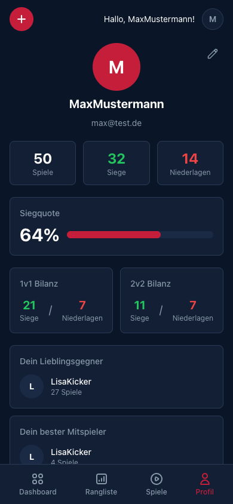
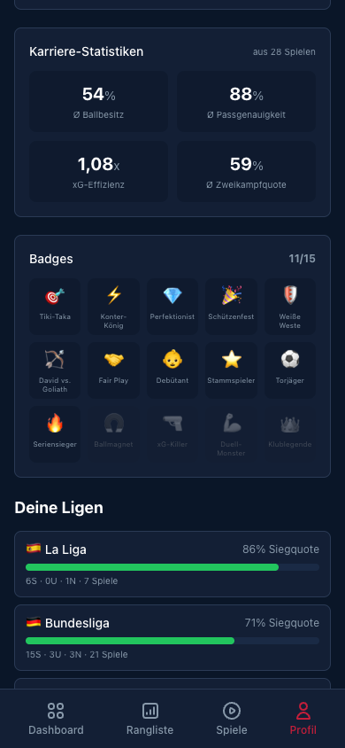

[← Zurück zur Übersicht](../../README.md)

# 👤 Profil — Deine Kicker-Karriere

Das Profil vereint alles, was deine Kicker-Karriere ausmacht — von den Basis-Statistiken bis zu den freigeschalteten Badges.

---

## Statistik-Übersicht

### Header
- **Avatar** (hochladbar) mit Initialen-Fallback
- **Username** und **E-Mail**
- **Bearbeiten-Button** für Profil-Anpassungen

### Die Zahlen

| Metrik | Beispiel |
|--------|----------|
| **Spiele** | 50 |
| **Siege** | 32 |
| **Niederlagen** | 14 |

### Siegquote

Große Prozentanzeige mit visuellem Fortschrittsbalken:
- **Rot** = Siegquote
- **Grauer Rest** = Unentschieden + Niederlagen

### Modus-Bilanz

Getrennte Aufschlüsselung:
- **1v1 Bilanz**: 21 Siege / 7 Niederlagen
- **2v2 Bilanz**: 11 Siege / 7 Niederlagen

### Favoriten

- **Lieblingsgegner** — Gegen wen spielst du am häufigsten?
- **Bester Mitspieler** — Mit wem gewinnst du am meisten?
- **Lieblingsteam** — Welchen Verein wählst du am häufigsten?

---

## Karriere-Statistiken

Aggregierte Werte aus allen Spielen mit FC26-Statistiken. Ein 2x2 Grid zeigt die vier wichtigsten Karriere-Metriken:

| Metrik | Wert | Beschreibung |
|--------|------|-------------|
| **Ø Ballbesitz** | 54% | Durchschnittlicher Ballbesitz über alle Spiele |
| **Ø Passgenauigkeit** | 88% | Wie präzise sind deine Pässe? |
| **xG-Effizienz** | 1,08x | Tore vs. Expected Goals — >1.0 bedeutet: du triffst mehr als erwartet |
| **Ø Zweikampfquote** | 59% | Wie viele Zweikämpfe gewinnst du? |

> Die Karriere-Statistiken erscheinen erst, wenn mindestens ein Spiel mit FC26-Stats existiert. Oben rechts wird angezeigt, aus wie vielen Spielen die Werte berechnet werden.

---

## Badges

15 einzigartige Badges — sammle sie alle.

### So funktioniert es

- Badges werden **automatisch** freigeschaltet basierend auf deinen Spielen und Statistiken
- **Freigeschaltete Badges** werden farbig und mit ihrem Emoji angezeigt
- **Gesperrte Badges** sind ausgegraut
- Oben rechts: Fortschritt (z.B. *11/15*)

### Alle 15 Badges

| Badge | Name | Wie freischalten? |
|-------|------|-------------------|
| 🎯 | **Tiki-Taka** | 65%+ Ballbesitz in einem Spiel |
| ⚡ | **Konter-König** | Sieg mit unter 40% Ballbesitz |
| 💎 | **Perfektionist** | 100% Passgenauigkeit in einem Spiel |
| 🎉 | **Schützenfest** | Sieg mit 5+ Toren Unterschied |
| 🛡️ | **Weiße Weste** | Sieg ohne Gegentor (Clean Sheet) |
| 🏹 | **David vs. Goliath** | Sieg mit unter 30% Ballbesitz |
| 🤝 | **Fair Play** | 10+ Spiele ohne eine einzige Gelbe Karte |
| 👶 | **Debütant** | Erstes Spiel absolviert |
| ⭐ | **Stammspieler** | 25+ Spiele absolviert |
| 👑 | **Klublegende** | 100+ Spiele absolviert |
| ⚽ | **Torjäger** | 50+ Karrieretore erzielt |
| 🔥 | **Seriensieger** | 5+ Siege in Folge |
| 🧲 | **Ballmagnet** | 70%+ Passgenauigkeit in einem Spiel |
| 🔫 | **xG-Killer** | xG-Effizienz über 1.5 in einem Spiel |
| 💪 | **Duell-Monster** | 60%+ Zweikampfquote in einem Spiel |

> **Tipp**: Manche Badges erfordern FC26-Statistiken (Tiki-Taka, Konter-König, etc.). Je mehr Spiele mit Stats, desto mehr Badges lassen sich freischalten.

---

## Liga-Statistiken

Deine Performance aufgeschlüsselt nach den Ligen der gewählten Teams:

- **Flagge** und **Liga-Name**
- **Siegquote** als Prozent mit Fortschrittsbalken
- **Bilanz**: Siege · Unentschieden · Niederlagen · Spiele

> Beispiel: 86% Siegquote in La Liga (6S · 0U · 1N · 7 Spiele), 71% in der Bundesliga (15S · 3U · 3N · 21 Spiele).

---

## Profil bearbeiten

- **Username** ändern
- **Avatar** hochladen (max. 2 MB)
- Tippe auf das Stift-Icon neben dem Profilbild

---

[← Rangliste](LEADERBOARD.md) · [Zurück zur Übersicht](../../README.md) · [KI-Features →](AI_FEATURES.md)
