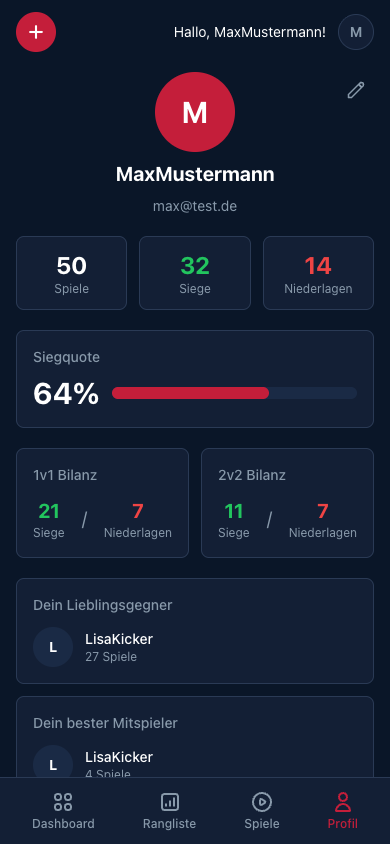
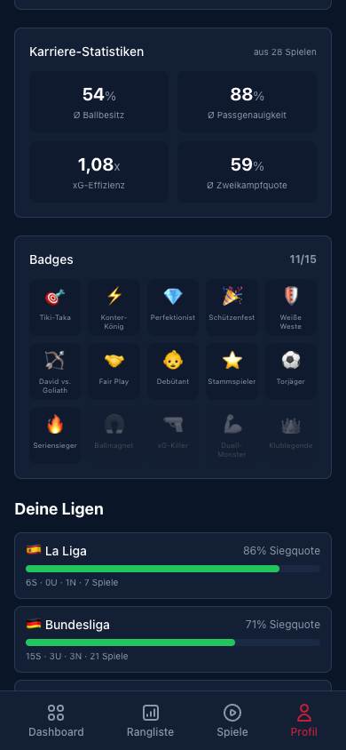

[← Back to overview](../../README.md)

# 👤 Profile — Your FC26 career

The profile brings together everything that defines your FC26 career — from your ELO curve to your trophy shelf. First visit? A short guided tour shows you around.

---

## Player card

### Header

- **Avatar** (uploadable) with initials fallback
- **Username** and your **player type** — e.g. *Der Vollstrecker* or *Der Stratege*, derived from your six character axes. Newcomers see *Freshman* or *Developing* first; the info icon explains it
- **Rank** and number of matches
- Current **ELO** with this week's trend and a sparkline
- **Marcel's take** — a short verdict on your character
- **W · D · L** and **win rate**
- Avatar and username are changed in **Settings** — see [Edit profile](#edit-profile)

### Player character

A radar chart with six axes — **Finisher**, **Playmaker**, **Clutch**, **Consistency**, **Discipline** and **Winner** — drawn against a *League average* baseline, plus auto-generated tags for your character, strengths and weaknesses. Tap an axis icon to see what it measures.

### Current form

Your last 5 results with the ELO change over those matches, an ELO curve with a green or red dot per result, and a short comment from Marcel.

### Favourite & nemesis

- **Favourite** — the opponent you have the best win rate against
- **Nemesis** — the opponent you have the worst win rate against
- **Top duo** — the teammate you have the best win rate with

Each needs at least 3 matches. Tap one to open their profile.

---

## Career stats

Six career-wide numbers, calculated over your whole match history:

| Metric | Description |
|--------|-------------|
| **Total goals** | All your goals, plus goals per game |
| **Assists** | All your assists, plus assists per game |
| **Longest streak** | Most wins in a row |
| **Hattricks** | Matches with 3+ goals |
| **Biggest win** | Score, opponent and date |
| **Peak ELO** | Your highest rating and when you reached it |

> Numbers that don't exist yet show a dash instead of hiding the card.

---

## Awards & trophy room

### Top awards

The profile shows your three best trophies — rarest first (diamond, gold, silver, bronze), then the newest. Trophies from the last 7 days carry a **New** pill. The section also tells you how many trophies you've earned in total; **View all →** opens the trophy room.

### Trophy room

- **Progress** at the top: trophies earned out of the total, and how complete your collection is
- **Most recent** trophy up front
- **Shelves** per category: Win, Streak, Goal, Defensive, Special, Duo, Rivalry, Meta and Hidden
- **Four rarities**: bronze, silver, gold and diamond
- **Hidden trophies** stay *???* until you earn them
- Tap a trophy for the details — when you earned it, or how far along you are

---

## Other players' profiles

Tap a player on the leaderboard, in the Top 3 or in your relations to open their profile — same sections, and **View all →** leads to their trophy room.

---

## Edit profile

Editing happens in **Settings**, not on the profile itself: tap your avatar in the top-right corner and choose **Settings**.

- Change **username**
- Upload **avatar** (max. 2 MB) — tap the picture in the **Edit profile** card
- Confirm with **Save**

---

[← Leaderboard](LEADERBOARD.md) · [Back to overview](../../README.md) · [AI Features →](AI_FEATURES.md)
